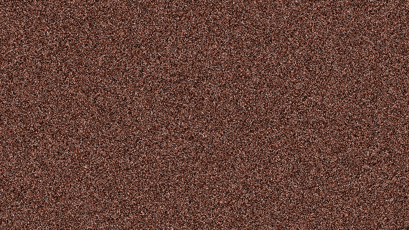

# Image Corrupter

This is a Python script that takes an image and a seed as input, mixes the pixels of the image using the seed, and then saves the reversed image to a "images" folder. The same seed can be used to unreverse the reversed image.

## Usage

Clone and move to this repository.

```bash
git clone https://github.com/Justzienz/PixelMixer/
cd PixelMixer
```

To use the script, run the following command in your terminal:

```
python3 reverser.py -seed [seed] -path [/path/to/image]
```

- The `-seed` option is required and should be followed by a seed string. Seed can be anything, with any length. If you lose the seed, you can NOT reverse the corruption
- The `-path` option is optional and should be followed by the path to the image file. If no path is provided, the script will assume that the image file is named "image.png" and is located in the same directory as the script.

## Example

Here's an example of how to use the script:

```
python3 reverser.py -seed "my_seed_string" -path "/path/to/my/image.png"
```

This will mix the pixels of the image located at "/path/to/my/image.png" using the seed "my_seed_string", and save the reversed image to a "images" folder.

### The original image;
 
### Will turn into something like this;
 

## Notes

- The script requires the Pillow library to be installed. You can install it using pip:

  ```
  pip install Pillow
  ```

- The script works with image files in the PNG, and JPG format.

- If you lose the seed used to reverse the image, there is no way to recover the original image.

## License

This project is licensed under the MIT License - see the [LICENSE](LICENSE) file for details.
